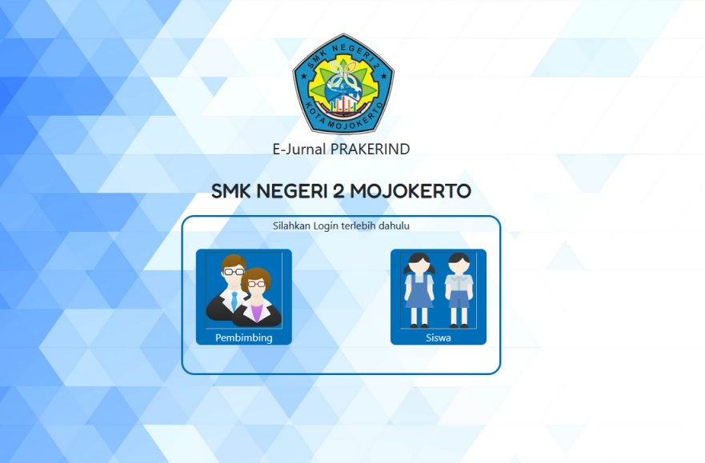
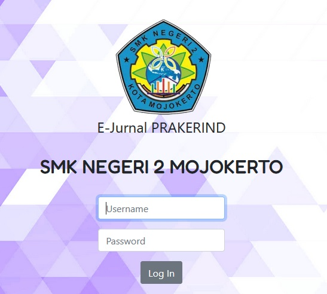
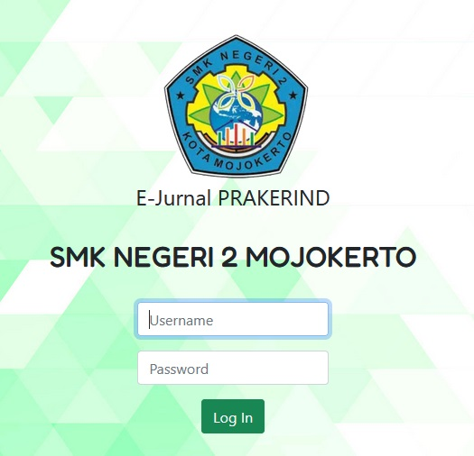

# ABOUT MY WEB APPLICATION
This web created to support internship program in my school ( vocational high school ). The purpose of this website is to create a platform for students in internship (especially if their internship take place outside Mojokerto City or outside of East Java Province) to record their daily activities during internship and be reviewed later by their teacher.

By reviewing their students daily activities in this journal, teacher will know their students conditions, what problems they are facing and what 'first aid' solutions they can give for their students.

After the internship ended, teachers will upload certificate of completion for students under their care. Students can download their certificate of completion.
## Database
My database name is internship.db. There are 6 tables in my database. The tables are 'siswa', 'pembimbing', 'dudi', 'admin', 'sertifikat' and 'jurnal'.

###    1.    Table 'siswa'
Table 'siswa' contain data of students doing internship in current year. This table has 7 columns :
-    id_siswa - INTEGER AUTOINCREMENT PRIMARY KEY
-    username
-    password
-    nama (student's name)
-    Kelas (student's class name)
-    id_pembimbing (teacher's id, a foreign key to connect with table 'pembimbing')
-    id_dudi (workplace's id, a foreign key to connect with table 'dudi')

###    2.    Table 'pembimbing'
Table 'pembimbing' contain data of the teacher. This table has 5 columns :
-    id_pembimbing - INTEGER AUTOINCREMENT PRIMARY KEY
-    username
-    password
-    nama_pembimbing (teacher's name)
-    nomor_telepon (teacher's phone number)

###    3.    Table 'dudi'
Table 'dudi' contain data of companies, office, hotels that become partner for the internship program. This table has 4 columns :
-    id_dudi - INTEGER AUTOINCREMENT PRIMARY KEY
-    nama_dudi (name of the companies, offices that are partner)
-    alamat_dudi (address of the companies, offices that are partner)
-    nomor_telepon (phone number of the companies, offices that are partner)

###    4.    Table 'admin'
Table 'admin' contain data admins. This table has 5 columns :
-    id_admin - INTEGER AUTOINCREMENT PRIMARY KEY
-    username
-    password
-    nama (admin's name)
-    nomor_telepon (admin's phone number)

###    5.    Table 'sertifikat'
Table 'sertifikat' contain data certificate of completion for each student. This table has 5 columns :
-    id_sertifikat - INTEGER AUTOINCREMENT PRIMARY KEY
-    id_siswa (student's id to connect with table 'siswa')
-    nama_siswa (student's name)
-    kelas (student's class)
-    path (place where the certificate of completion been stored)

###    6.    Table 'jurnal'
Table 'jurnal' contain data of daily activities of students during their internship. This table has 6 columns :
-    id_jurnal - INTEGER AUTOINCREMENT PRIMARY KEY
-    id_siswa (student's id to connect with table 'siswa')
-    waktu_tanggal (date)
-    kegiatan (student's activities)
-    persetujuan (approval from teacher, the value is 'setuju (approved)' and 'Perlu Perbaikan (need to be revised)')
-    keterangan (in this column, teacher can add 'PS' or solutions or advise for students regarding what student's doing during their internship)

## Technologies / Software
Technologies or software i use to build this website :
####    -    Python 3.11.8
####    -    Flask 3.0.2
####    -    Jinja2 3.1.3
####    -    SQLite3 2.6.0
####    -    HTML5
####    -    Bootstrap 5.1.3
####    -    CSS

I use python, flask, jinja, and sqlite3 because they are new for me and i want to learn further about how to implement them in website development.

## Website Structure
The structure of website i created are landing page, login pages, dashboard and pages to manipulate data (add, update and delete).
####    1.    Landing Page

####    2.    Login Pages
       

####    3.    Dashboard
Dashboard Admin

Dashboard Pembimbing

Dashboard Siswa

####    4.    Pages to manipulate Data
Insert Data

Update/Edit Data

Delete Data

## Development
I develops this website on my own, for around a week started from 24 February 2024.

