# progate.github.io
Tugas proyek untuk progate_digitalent kelompok F34

# ABOUT MY WEB APPLICATION
This web created to support internship program in my school ( vocational high school ). The purpose of this website is to create a platform for students in internship (especially if their internship take place outside Mojokerto City or outside of East Java Province) to record their daily activities during internship and be reviewed later by their teacher.

By reviewing their students daily activities in this journal, teacher will know their students conditions, what problems they are facing and what 'first aid' solutions they can give for their students.

After the internship ended, teachers will upload certificate of completion for students under their care. Students can download their certificate of completion.

## Getting Started
I assume you use codespace from cs50.dev if soo, follow this steps:

1.    Login into your codespace
2.    In your terminal, execute cd by itself. You should find that its “prompt” resembles the below.

3.    Upload my ZIP file internship.zip to your codespace
4. Execute this to unzip:

    

    if you succeed, you will find folder 'internship' in your codespace :

    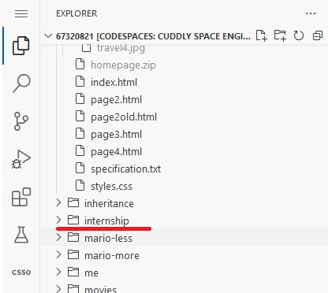
5.    Remove the internship.zip file by executing :

        

6.    Now, enter internship directory by typing this in terminal :

        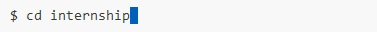

        if you succeed, you will see :

        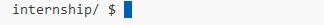

7.    Type flask run then enter :

        

8.    Klik 'Open in Browser'

        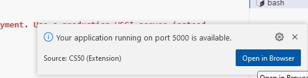

        You will see this :
        

## ACCESS THE WEBSITE
You can access the website as :
-    admin
-    pembimbing (teacher)
-    siswa (student)
#### ADMIN
1.    Klik the big logo of 'SMK NEGERI 2 MOJOKERTO
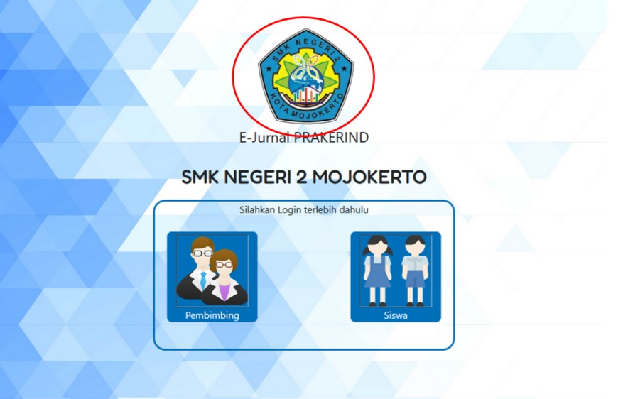
2.    For this login_page

        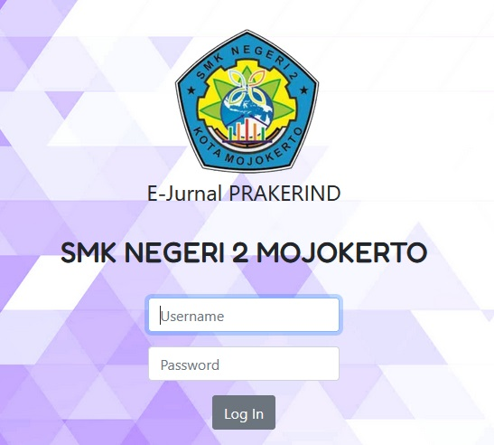

        Login using :
        -    username : admin
        -    password : admin123
3.    In this page you will see 'Admin', 'Pembimbing', 'Siswa', 'Industri'.
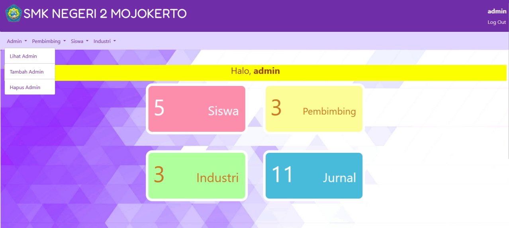

        Each will contain:

        Admin
        -    Lihat Admin (Show Admin)
        -    Tambah Admin (Add Admin)
        -    Hapus Admin (Delete Admin)

        Pembimbing
        -    Tambah Pembimbing (Add Teacher)
        -    Lihat Pembimbing (Show Teacher)
        -    Hapus Pembimbing (Delete Teacher)
        -    Cari (Search), you can search teacher based on their name

        Siswa
        -    Tambah Siswa (Add Student)
        -    Lihat Siswa (Show Student)
        -    Hapus Siswa (Delete Student)
        -    Cari (Search), you can search student based on their name

        Industry (Companies or Workplaces where student doing their internship)
        -    Tambah Industri (Add Industry)
        -    Lihat Industri (Show Industry)
        -    Hapus Industri (Delete Industry)
        -    Cari (Search), you can search Industry based on their name and address
#### PEMBIMBING
1.    Klik the logo of 'Pembimbing'

        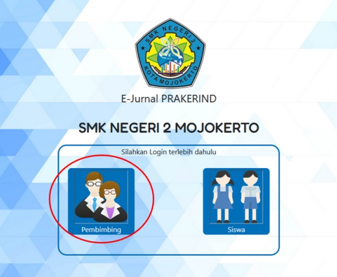
2.    For 'Pembimbing' login_page

        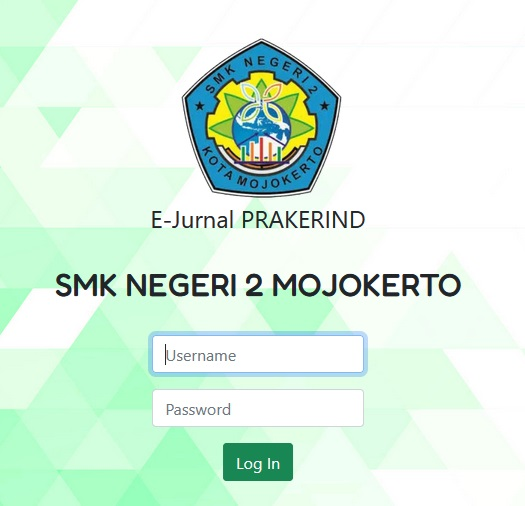

        You can login using :
        -    username : emimi
        -    password : emi123
3.    In this page you will see 'Lihat Siswa', 'Jurnal', 'Sertikat', 'Ubah Password'.

        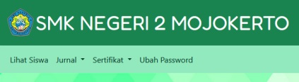

        Lihat Siswa (See Siswa) , list of student under teacher's care

        Jurnal
        -    Lihat Jurnal (Show Journal), teacher need to give 'setuju (approved)' or 'perlu perbaikan(need to be revised)', teacher also can give solutions for students problem in 'keterangan'
        -    Hapus Journal (Delete Journal)
        -    Cari (Search), you can search journal based on student's name or journal's date

        Sertifikat
        -    Upload Sertifikat (Upload Certificate)
        -    Lihat Sertifikat (Show Certificate)
        -    Cari (Search), you can search certificate based on student's name to know whether their certificate already been uploaded or not.

        Ubah Password (Change Password)

        <b>Some translation:</b>
        -    Pilih ID Siswa - Choose Student ID
        -    Pilih Nama Siswa - Choose Student Name
        -    Pilih Kelas - Choose Class

#### SISWA
1.    Klik the logo of 'Siswa'

        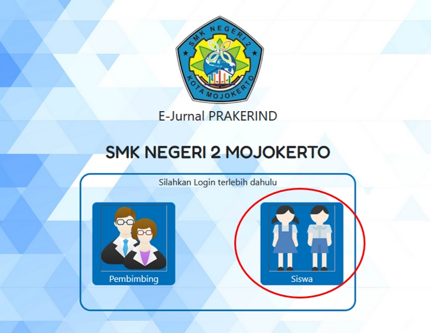
2.    For 'Siswa' login_page

        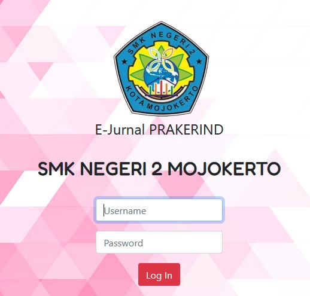

        You can login using :
        -    username : candracan (but candra don't have certificate of completion, because his internship is not finished)
        -    password : candra123

        OR
        -    username : santisan (santi already has certificate of completion, uploaded by her teacher)
        -    password : santi123
3.    In this page you will see 'Lihat Jurnal', 'Isi Jurnal', 'Ubah Jurnal', 'Hapus Jurnal', 'Ganti Password', 'Sertifikat'.

        

        Lihat Jurnal (See Journal) , list of journals made by student who is login. You can filter the data based on date.

        Isi Jurnal (Add Journal)

        Ubah Jurnal (Edit Journal), You can filter the data based on date.

        Hapus Jurnal (Delete Journal), You can filter the data based on date.

        Ganti Password (Change Password)

        Sertifikat ( Certificate of Completion )

## Video Preview

    https://drive.google.com/drive/folders/1GE-3pj3B3jRgbAmLatHirQImVhRnO9PN?usp=sharing

